# MCP (Model Context Protocol)
by Gaurav Kabra

The Model Context Protocol (MCP) is a standardized way, introduced by Anthropic, for LLMs to interact with external tools and functions and injecting context in LLMs. It allows models to:

* Request real-time information
* Execute actions in external systems
* Access specialized knowledge
* Interact with APIs and services

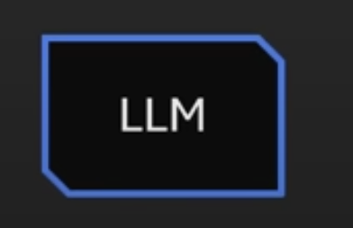
→ Agents 
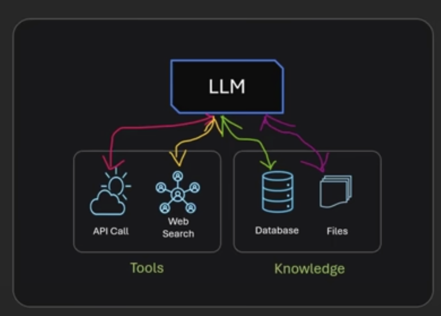→ 
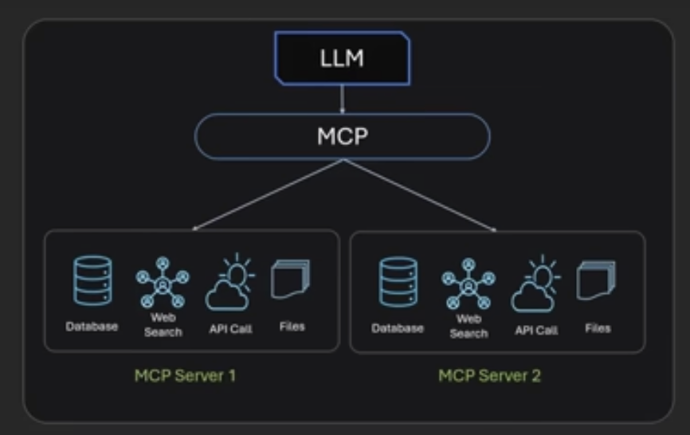
The 2nd figure is like this:
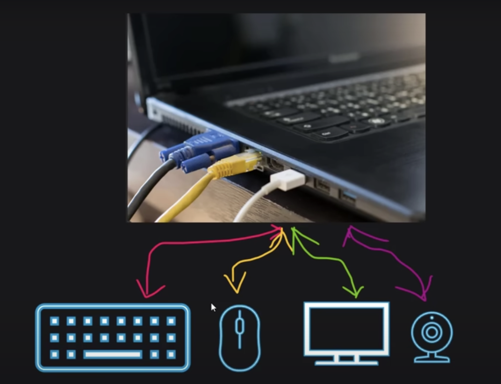

So we improve and get to the 3rd figure, which is similar to:
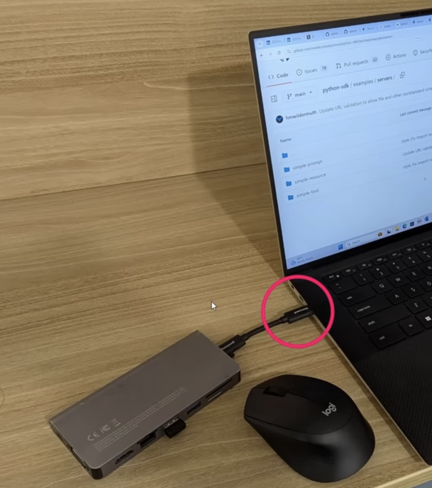
The MCP is similar to USB hub in above picture.
Due to it being a standard, changes become in a standard way. So less chances of API breaking since each MCP server is now being maintained by individual companies (Yahoo or Google etc.) and we just integrate with them.

An MCP server will expose 3 things:

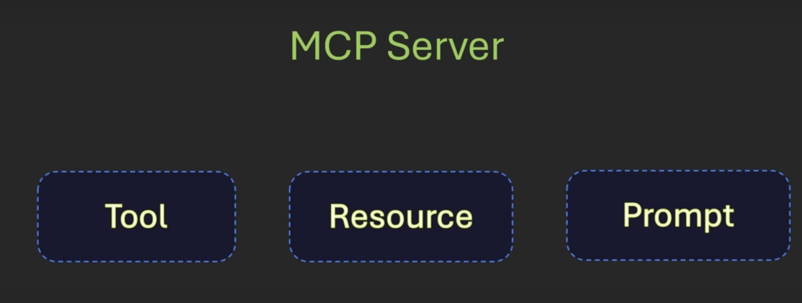Tool:
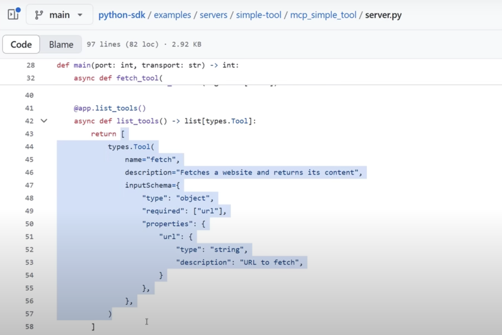
Resource: includes knowledge base, DB, files etc.
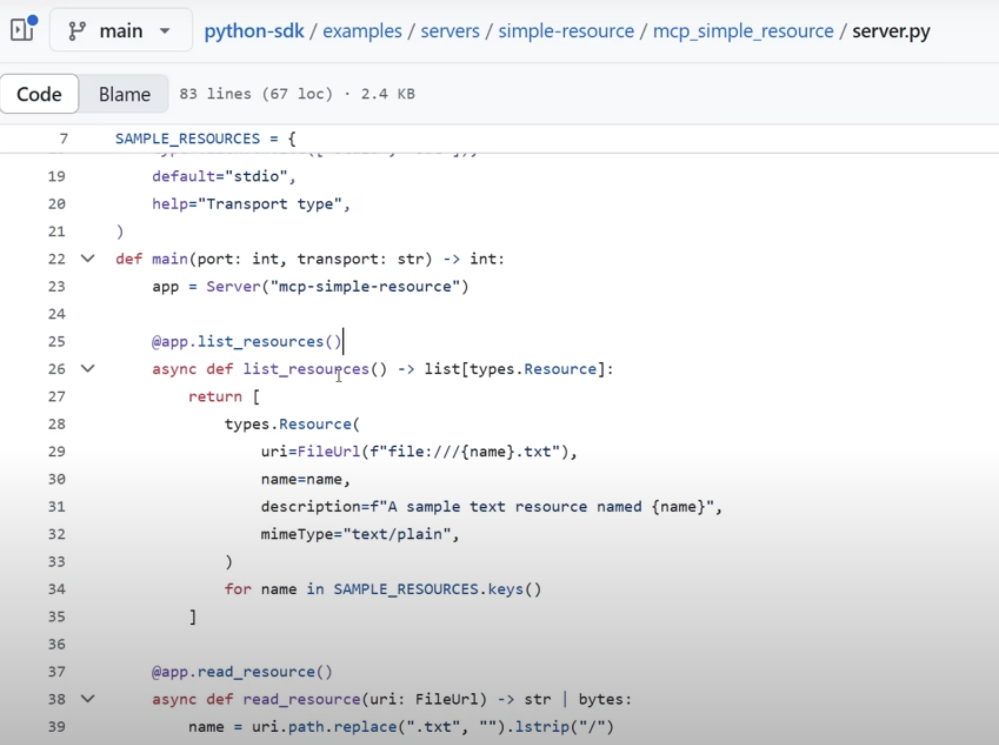
Prompt:
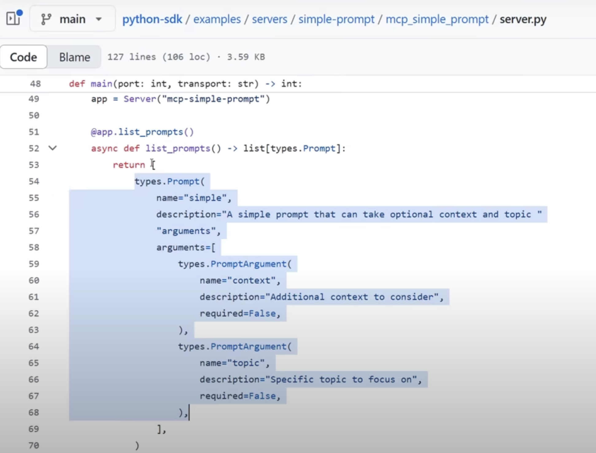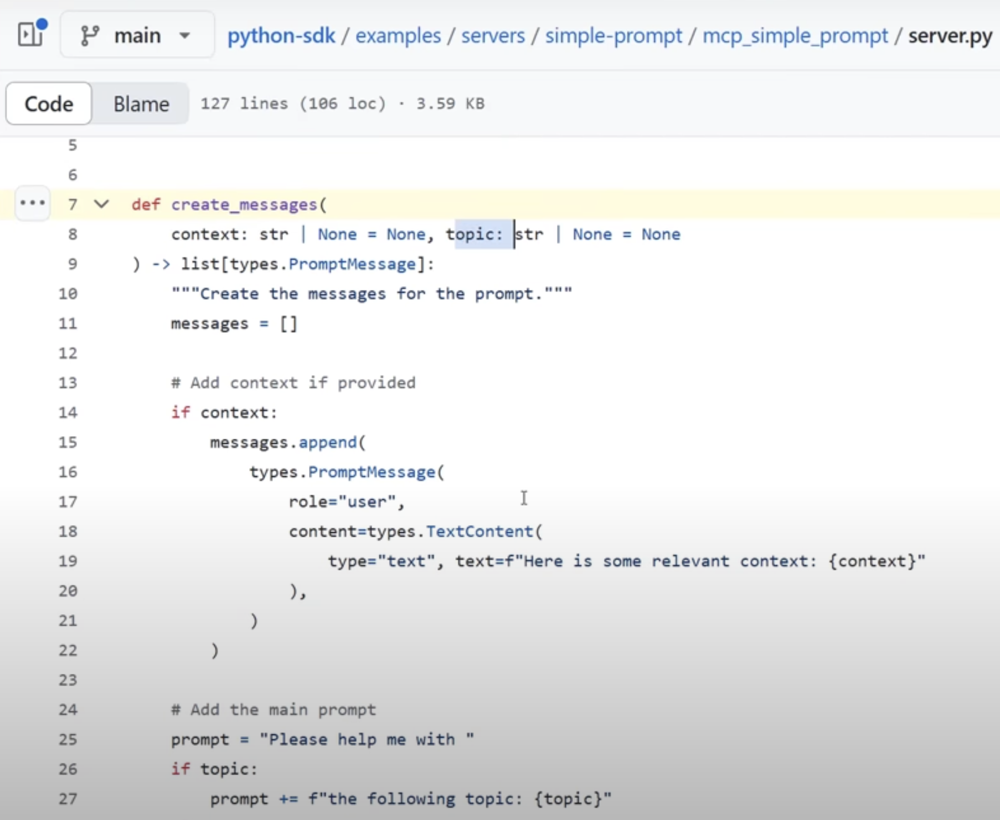

You can refer [this](https://github.com/modelcontextprotocol/python-sdk/blob/main/examples/clients/simple-chatbot/mcp_simple_chatbot/main.py) for above images.


## Setup From Scratch

```
mkdir mcpserver
npm init
npm install @modelcontextprotocol/sdk
```

See [this](https://github.com/modelcontextprotocol/typescript-sdk) for official documentation.

Now in Cursor IDE, click on Settings cog -> MCP and it should show the `add` tool available:
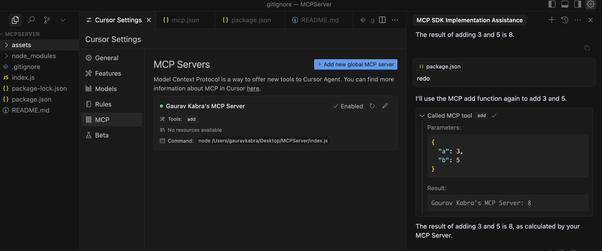

You can find documentation [here](https://docs.cursor.com/context/model-context-protocol).

Do CMD + I and ask to add two numbers and you should see a response which we coded in `index.js`.

STDIO (Standard Input-Output) is ideal on local but for remote we use SSE transport (Server Sent Event). See [this](https://modelcontextprotocol.io/docs/concepts/transports) to know more.

